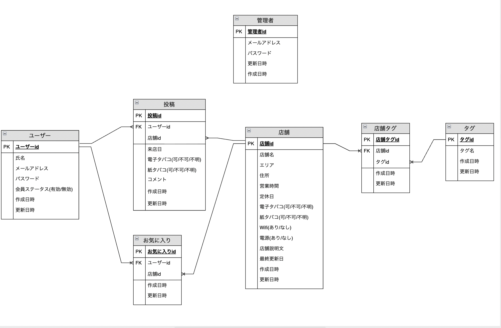
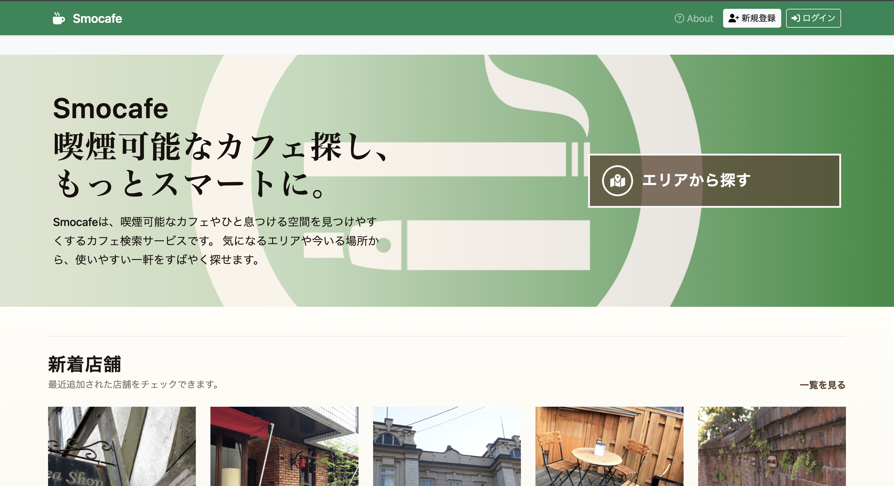
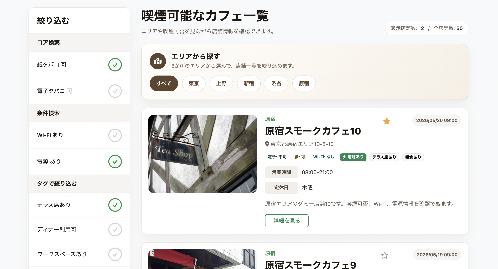
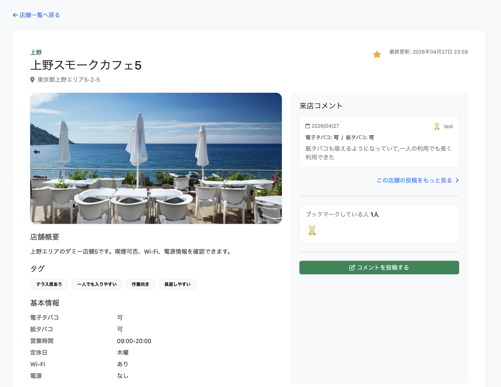
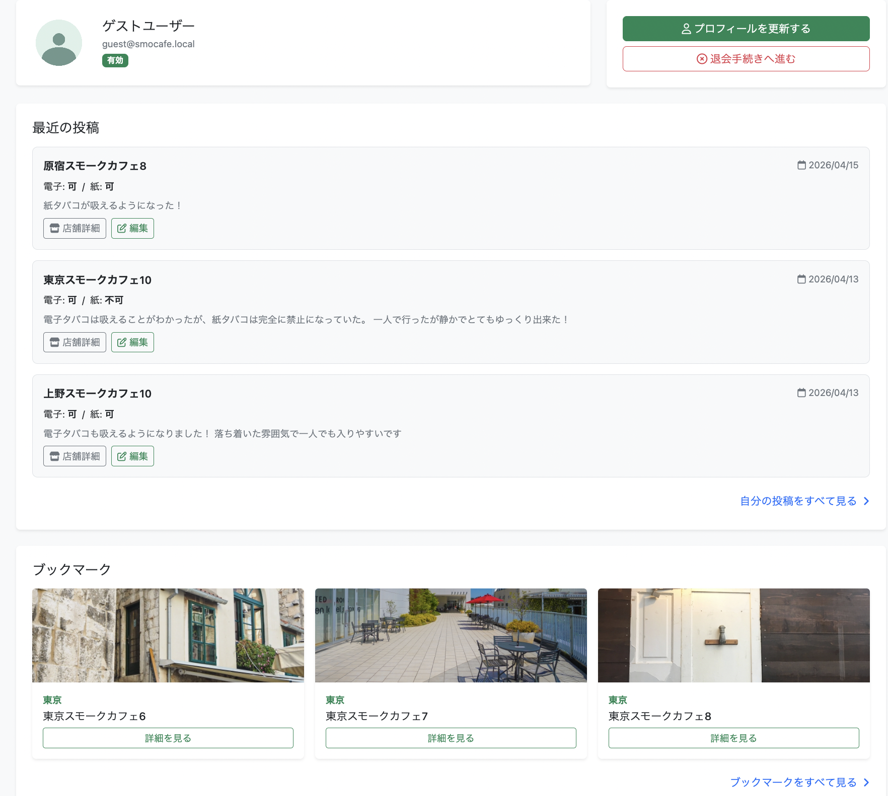

# スモカフェ

## サイト概要

### サイトテーマ
主に電子タバコ(加熱式タバコ)が利用可能なカフェ・喫茶店を探せる投稿型情報共有サイト
​
### テーマを選んだ理由
私は普段からカフェで作業をすることが多く、その中で「電子タバコが吸えるカフェ」を探すことに不便さを感じていました。特に2020年(健康増進法の改正)から喫煙に関する規制が厳しくなり、「紙タバコは不可だが電子タバコは可能」など店舗ごとのルールが複雑化しており、既存のサービスでは正確な情報を得ることが難しいと感じています。

また、Googleマップやレビューサイトでは喫煙可否に関する情報が曖昧であったり、最新の状況が反映されていないケースも多く、実際に現地に行って初めて分かることが多いという課題があります。このような状況は、電子タバコユーザーにとって大きなストレスになっていると感じています。

そこで、ユーザー自身が実際の来店情報を投稿し、喫煙条件をリアルタイムに近い形で共有できるサービスを作ることで、同じ悩みを持つ人の課題を解決できると考え、本テーマを選定しました。

---

## 公開URL

https://smocafe.jp

※ 本アプリは HTTPS に対応しており、HTTP（http://smocafe.jp）でアクセスした場合も自動的に HTTPS にリダイレクトされます。

---

## ゲストログイン

動作確認用にゲストアカウントを用意しています。

| 項目 | 内容 |
|------|------|
| メールアドレス | guest@smocafe.local |
| パスワード | smocafe-demo-user |

※ ゲストアカウントはポートフォリオ確認用です。

---

### ターゲットユーザ
- 電子タバコ（加熱式タバコ）を利用しており、喫煙可能なカフェを探したい人
- カフェで作業や休憩をする際に、喫煙環境も重視したい人
- 実際に訪れた店舗の喫煙情報を共有したい人

---

### 主な利用シーン
- 外出先や移動中に、電子タバコが吸えるカフェを探したい時
- 作業できるカフェを探す際に、喫煙の可否も条件に入れたい時
- 実際に訪れた店舗の喫煙ルールを他のユーザーに共有したい時

---

### 基本機能
| 機能名 | 概要 |
|--------|------|
| 会員登録・ログイン | ユーザー登録後、店舗のブックマークやコメント投稿が可能 |
| 店舗一覧表示 | 喫煙可能なカフェを一覧で閲覧 |
| 店舗詳細表示 | 喫煙区分、Wi-Fi、電源、営業時間、定休日、タグなどを確認 |
| エリア検索 | 原宿・渋谷・新宿などエリア単位で店舗を検索 |
| 条件絞り込み | 紙たばこ可否、加熱式たばこ可否、Wi-Fi、電源ありなどで絞り込み |
| タグ絞り込み | 店の雰囲気や設備などでさらに詳細に絞り込み |
| ブックマーク | 気になる店舗をお気に入り保存 |
| コメント投稿 | 実際の利用者が来店コメントを投稿 |
| マイページ | 自分のプロフィール、投稿、ブックマーク情報を確認 |
| 管理者画面 | 店舗・タグ・会員・投稿内容を管理 |

---
​
## 設計書

### ER図

---

## 画面イメージ

### トップページ

### 店舗一覧画面

### 店舗詳細画面

### マイページ

---

## 開発環境
- OS：Amazon Linux
- 言語：HTML,CSS,JavaScript,Ruby,SQL
- フレームワーク：Ruby on Rails
- JSライブラリ：jQuery
- IDE：Visual Studio Code（VSCode）

---

## インフラ・本番環境

| 項目 | 内容 |
|------|------|
| インフラ | AWS EC2 |
| OS | Ubuntu |
| Webサーバー | Nginx |
| アプリケーションサーバー | Puma |
| データベース | MySQL |
| ドメイン | smocafe.jp |
| SSL/TLS | Let's Encrypt（Certbot） |

---

## 今後の改善点

- 現在地情報を利用した周辺店舗検索機能
- Google Maps API を用いた店舗位置表示
- 実データとの連携
- 検索条件のさらなる細分化

---
​
## 使用素材
著作権を考慮し、架空のデータを扱う予定です。なお今後、実在するデータを利用する際には、事前に著作権保持者と契約を結んだ上で利用します。

利用した外部サービス

Fontawesome (https://fontawesome.com/)

illustAC (https://www.ac-illust.com/)

photoAC (https://www.photo-ac.com/)

---

## 補足

本アプリはポートフォリオとして開発しており、店舗情報はダミーデータを使用しています。
